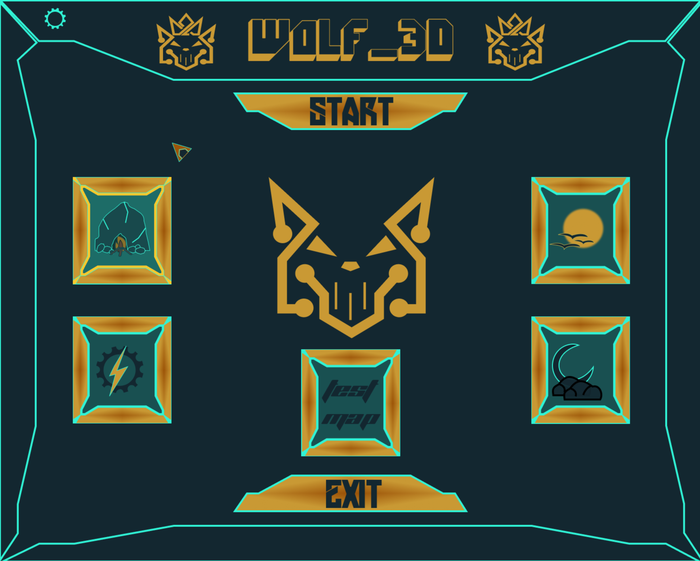
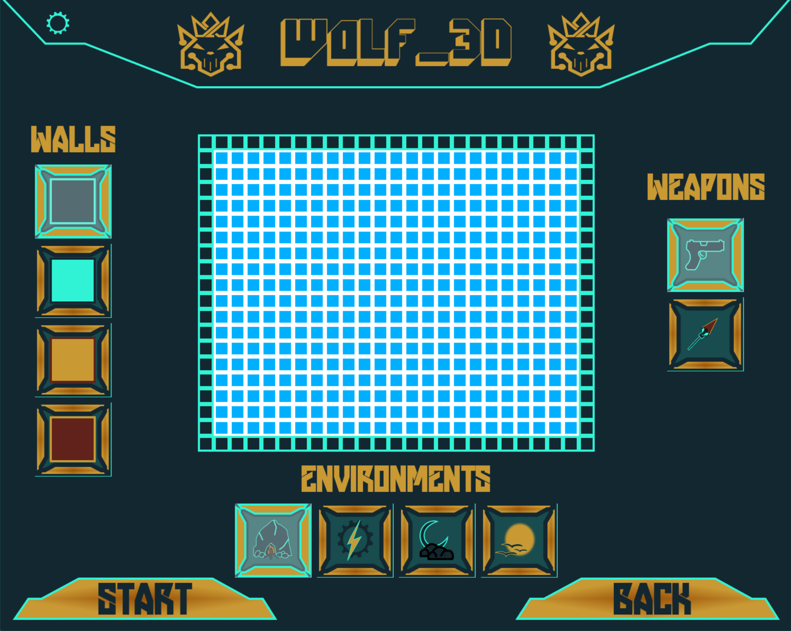

# wolf3d

As a graphic design project, Wolf3D will enable you to solidify your skills in this area:
windows, colors, events, fill shapes etc.
To conclude Wolf3D is a remarkable playground to explore the playful practical applications of mathematics without having to understand the specifics. John Carmack is
undoubtedly a genius. He was one of the first programmers to think about these applications and remains famous for them today. With the help of the numerous documents
available on the internet, you will use mathematics as a tool to create elegant and efficient
algorithms. There's multiple sounds effects and light shading so the game look realistic.

#### *How to install SDL2*

The SDL2 framework folder is already in this repo.
But if it didn't work for you, you can install the SDL2 library in you machine.

__*Ubuntu:*__

```bash
sudo apt-get install libsdl2-dev libsdl2-mixer-dev libsdl2-ttf-dev
```

__*Fedora:*__

```bash
sudo dnf install SDL2-devel SDL2_mixer-devel SDL2_ttf-devel
```

__*MacOS:*__

All ready for use. Just type **make**.

__*Windows:*__

- [MinGW](http://lazyfoo.net/tutorials/SDL/01_hello_SDL/windows/mingw/index.php).
- [Visual Studio](http://lazyfoo.net/tutorials/SDL/01_hello_SDL/windows/msvsnet2010u/index.php).

## Compiling

Use [make](https://en.wikipedia.org/wiki/Makefile) for compiling all files.

When you have already installed SDL2 library you can use this simple rules:
- **make**: Compile all.
- **make clean**: Delete temporary files.
- **make fclean**: Delete executable Wolf3D file & libft.
- **make re**: It's rules - **make fclean** & **make** in one.

## Usage:

```bash
./wolf3d
```

- `[W | S]`: Moving forward | backward.
- `[A | D]`: Rotate left | right.
- `[ESC]`: Return to the menu page | Close Wolf3D.
- `[Left SHIFT]`: crouch.
- `[SHIFT | RIGHT MOUSE BUTTON]`: Fire.
- `[T]`: Night Mode.
- `[M]`: Mute environment Sound.

# Intro page


# Map Generator


# Standard mode


